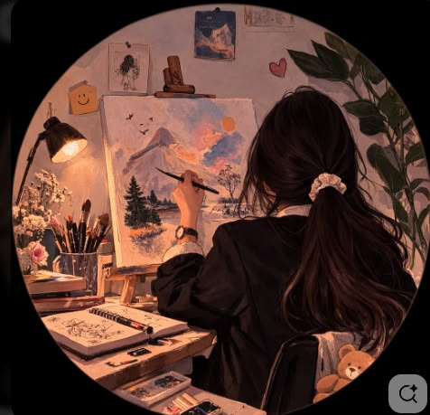
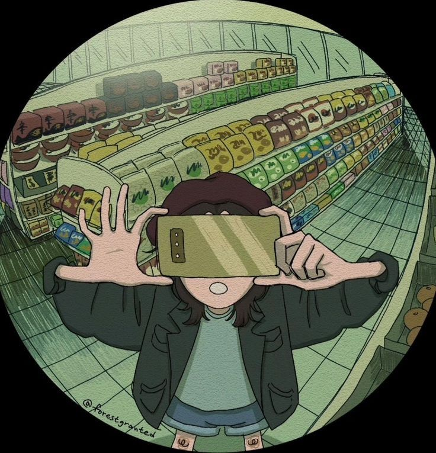

<!-- ================= ABOUT ME ================= -->
<table>
<tr><td colspan="3"></td></tr>
<tr>
<td></td>
<td>

## About Me
I'm **Vrunda Bramhe**, a B.Tech student in **Artificial Intelligence** at St. Vincent Pallotti College of Engineering, Nagpur (CGPA: 9.68), graduating in 2027. I'm passionate about **full stack development** — building complete web applications from the ground up, crafting clean frontends with HTML, CSS, and JavaScript, and backing them with solid logic and databases.

</td>
<td></td>
</tr>
<tr><td colspan="3"></td></tr>
</table>

 

<!-- ================= FEATURED PROJECTS ================= -->
<table>
<tr><td colspan="3"></td></tr>
<tr>
<td></td>
<td>

## Featured Projects

| FarmRentals | DishFetch |
|---|---|
| **Equipment Rental Platform for Farmers** A platform enabling farmers to monetize idle farming equipment by renting it out to others during off-seasons. **Highlights:** • Built the frontend with HTML, CSS & JavaScript • Designed a SQL backend to manage and display rental listings **Tech Stack:** HTML, CSS, JavaScript, SQL | **Recipe Search & Management App** A recipe discovery app for culinary enthusiasts, built with a clean MVC architecture. **Highlights:** • Modular architecture for faster development • Integrates a live recipe API for real-time data retrieval **Tech Stack:** JavaScript, HTML/CSS |

</td>
<td></td>
</tr>
<tr><td colspan="3"></td></tr>
</table>

 

<!-- ================= TECH STACK ================= -->
<table>
<tr><td colspan="3"></td></tr>
<tr>
<td></td>
<td>

## Tech Stack

**Languages & Frontend**
 

**Backend & Database**
 

**Tools & Platforms**
 

</td>
<td></td>
</tr>
<tr><td colspan="3"></td></tr>
</table>

 

<!-- ================= BEYOND CODE ================= -->
<table>
<tr><td colspan="3"></td></tr>
<tr>
<td></td>
<td>

## Beyond Code

|  **Paint 🎨** brushes, colors, lil sketches |  **Click Photos** capturing pretty lil moments |
|---|---|

</td>
<td></td>
</tr>
<tr><td colspan="3"></td></tr>
</table>

 

<!-- ================= LET'S CONNECT ================= -->
<table>
<tr><td colspan="3"></td></tr>
<tr>
<td></td>
<td align="center">

## Let's Connect

</td>
<td></td>
</tr>
<tr><td colspan="3"></td></tr>
</table>
